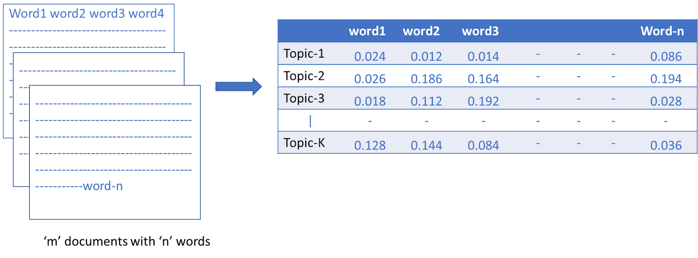
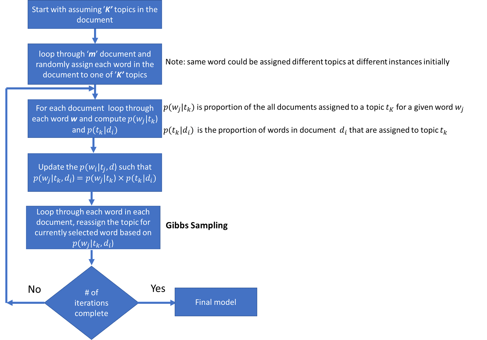

```{r setup, include=FALSE}
knitr::opts_chunk$set(echo = FALSE, message=FALSE, warning=FALSE, fig.height=4, fig.width=10)
```


```{r}
library(gutenbergr)
library(tidyverse)
library(stringr)
library(tidytext)
library(topicmodels)
library(scales)
library(kableExtra)
library(ggraph)
```

#### Abstract 

Using latent Dirichlet allocation (LDA), we build a model to automatically discover topics appearing in documents. More specifically, we combine four different books: 'Moby Dick' by Herman Melville, 'Dracula' by Bram Stoker, 'Don Quixote' by Miguel de Cervantes, and 'War and Peace' by Lev Nikolayevich Tolstoy, into a single document, then use LDA-based topic modelling to restore the text into their original forms. The books will be broken down into unorganized individual chapters and we will not know what words might distinguish them into groups. A LDA model will then be used to discover how chapters cluster into distinct topics, each of them representing one of the books. Finally, we will explore the limitations of the model by finding words and chapters that are assigned incorrectly.


#### Note:

* The text data that are used in this paper is taken from Project Gutenberg at https://www.gutenberg.org/.   


\newpage

### Introduction and Background

In text data mining, we often have collections of documents, such as blog posts or news articles, that we’d like to divide into natural groups so that we can identify meaningful patterns and understand them separately. An intuitive way of identifying the groups in such situations is to look for specific sets of keywords and based on the sets of keywords found, identify the type of the documents. In Natural Language Processing, this method is normally referred to as topic modelling. Topic modeling is a machine learning method for unsupervised classification of such documents, similar to clustering on numeric data, which finds natural groups of items even when we’re not sure what we’re looking for. A model trained to automatically discover topics appearing in documents is similarly referred to as a topic model. 

Latent Dirichlet allocation (LDA) is a particularly popular method for fitting a topic model. It treats each document as a mixture of topics, and each topic as a mixture of words. This allows documents to “overlap” each other in terms of content, rather than being separated into discrete groups, in a way that mirrors typical use of natural language (Silge & Robinson, 2017). Mathematically, LDA is described as a generative probabilistic model for collections of discrete data such as text corpora. The model is a three-level hierarchical Bayesian model, in which each item of a collection is modeled as a finite mixture over an underlying set of topics (Blei, Ng & Jordan, 2003). The machine learning LDA technique that we are going to use in this paper was introduced by David Blei, Andrew Ng and Michael I. Jordan in 2003.

In this paper, we will use the Latent Dirichlet Allocation to separate and distinguish chapters from four separate books:'Moby Dick' by Herman Melville, 'Dracula' by Bram Stoker, 'Don Quixote' by Miguel de Cervantes, and 'War and Peace' by Lev Nikolayevich Tolstoy. Using 'tidytext' package, the books will be broken down into unorganized individual chapters and then combined into a single dataset, which will be used for our LDA model. In particular, we will use the "topicmodels" package in R to create 'LDA' objects and then tidy and manipulate them using "tidyverse" package.

Using the model, we are interested in finding the mixture of words that is associated with each topic, while also determining the mixture of topics that describes each book.  We are also interested in which words and chapters that are assigned incorrectly to explore the limitations of the model.

### Methods  

A. Latent Dirichlet Allocation Algorithm

According to Great Learning Team, LDA assumes that documents are composed of words that help determine the topics and maps documents to a list of topics by assigning each word in the document to different topics. The assignment is in terms of conditional probability estimates as shown in figure 1. In the figure, the value in each cell indicates the probability of a word wj belonging to topic tk. ‘j’ and ‘k’ are the word and topic indices respectively. It is important to note that LDA ignores the order of occurrence of words and the syntactic information. It treats documents just as a collection of words or a bag of words. 

```{r,, fig.cap="Figure 1.Probability estimates for topic assignment to words.(Great Learning Team, 2021)"}

```

Once the probabilities are estimated, finding the collection of words that represent a given topic can be done either by picking top ‘r’ probabilities of words or by setting a threshold for probability and picking only the words whose probabilities are greater than or equal to the threshold value. 

One of the important inputs to LDA is the number of expected topics in the documents which need to be specified beforehand. Each topic has a weight that indicates the proportion of words in document that represent it.

LDA assumes that each document is generated by a statistical generative process. That is, each document is a mix of topics, and each topic is a mix of words. To identify the topics in the document, LDA begins with random assignment of topics to each word and iteratively improves the assignment of topics to words through Gibbs sampling, a process which we will refer to as LDA Algorithm.
 
The steps to LDA Algorithm are as following:

```{r,, fig.cap="Figure 2.General steps in LDA.(Great Learning Team, 2021)"}

```

$p(t_k|d_i)$ indicates how much document $d_i$ likes topic $t_k$. This is calculated by:
$$p(t_k|d_i)=\frac{n_{ik} + \alpha}{N_i - 1 + K\alpha}$$
where $n_ik$ is the total number of words in the $i^{th}$ document in $k^{th}$ topic, $N_i$ is the number of words in the $i^{th}$ document, K is the number of topics considered, and $\alpha$ is a hyper parameter.The $\alpha$ hyper parameter controls the number of topics expected in the document. Low value of $\alpha$ is used to imply that fewer number of topics in the mix is expected and a higher value implies that one would expect the documents to have higher number topics in the mix.

$p(w_j|t_k)$ indicates how much topic $t_k$ likes word $w_j$. This is calculated by:
$$p(w_j|t_k)=\frac{m_{j,k} + \beta}{\sum_{j\in V}m_{j,k} + V\beta}$$
where $m_{j,k}$ is the corpus wide assignment of a word $w_j$ to $k^{th}$ topic. V is the vocabulary(number of unique words) of the corpus, and $\beta$ is a hyper parameter. The $\beta$ hyper parameter controls the distribution of words per topic. At lower values of $\beta$, the topics will likely have fewer words and at higher values topics will likely have more words.

Ideally, we would like to see a few topics in each document and few words in each of the topics. So, $\alpha$ and $\beta$ are typically set below one.

$p(w_i|t_j,d)$ can then simply be calculated by:
$$p(w_i|t_j,d)=p(t_k|d_i) * p(w_j|t_k)$$

B. LDA application and additional techniques in R

The "topicmodels" package provides us with the LDA() function, which take a text dataset and a number "k", and returns an object containing the full details of the model fit, such as how words are associated with topics and how topics are associated with documents. "k" will determine the the number of topics associated with the document. For example, setting "k" = 2 will create a two-topic LDA model. We will then use tidy() method from "tidytext" package to tidy this model object. More specfically, we are interested in extracting the per-topic-per-word probabilities, called β (“beta”), from the model. 

Besides estimating each topic as a mixture of words, LDA also models each document as a mixture of topics. We can examine the per-document-per-topic probabilities, called γ (“gamma”), with the matrix = "gamma" argument to tidy(). Each gamma value is an estimated proportion of words from that document that are generated from that topic.

With the beta and gamma values, we can then use "tidyverse" packages for visualization to for a better understanding of the document.

With the methods stated above, we are going to use LDA to perform topic modeling on our set of classic literature" 'Moby Dick', 'Dracula', 'Don Quixote', and 'War and Peace'.

In addition to the LDA technique, we would also do a sentiment analysis on our text document, using the lexicon "NRC" to assign a positive/negative value to each word in the document. We would then calculate the sentiment score for every 150-line part of the books, which is equal to positive score minus negative score.

Last but not least, we will calculate the term frequency–inverse document frequency, or tf_idf, to see what words are most important in each of the books. Tf–idf is one of the most popular term-weighting schemes today. The idea of tf-idf is to find the important words for the content of each document by decreasing the weight for commonly used words and increasing the weight for words that are not used very much in a collection or corpus of documents. The main point of tf-idf is to identify words that are important to one document within a collection of documents. We will use the bind_tf_idf() that is included in the package "tidytext" to do most of the calculations for this.

### Pre-processing 

We are going to retrieve the text of these four books from Project Gutenberg website through "gutenberg" package. As pre-processing, we will divide the books into separate chapters, and then into separate words. This can easily be done by creating a new variable called 'chapter', that increases by one every time "chapter " appeared in the text for each 'title'. By doing this, we will know which word comes from which chapter and from which book. Although our LDA technique does not take chapters nor titles as an input, these information will help us with our visualization step as well as gaining more insight about the result later. We will also remove stop words from the document, which are a set of commonly used words in a language, to reduce the noise in our data. 

```{r}
books <- gutenberg_download(c(2701, 996,345,2600), 
                              meta_fields = "title")

by_chapter <- books %>%
  group_by(title) %>%
  mutate(chapter = cumsum(str_detect(
    text, regex("^chapter ", ignore_case = TRUE)
  ))) %>%
  ungroup() %>%
  filter(chapter > 0) %>%
  unite(document, title, chapter)

# split into words
by_chapter_word <- by_chapter %>%
  unnest_tokens(word, text)

# find document-word counts
word_counts <- by_chapter_word %>%
  anti_join(stop_words) %>%
  count(document, word, sort = TRUE) %>%
  ungroup()
```

For example, our tidied data will look like this:

```{r,, fig.cap="Table 1.First 10 entries of our tidied data"}
by_chapter_word %>%
  select(document,word)
```
We can also calculate word counts using normal tidy data technique.


```{r,, fig.cap="Table 2.Most common words in our collection"}
word_counts %>%
  arrange(desc(n)) %>%
  head(., 10) %>%
  kable()
```
### Results  

We perform LDA topic modelling on our tidied dataset and then extract the wanted values (beta and gamma).

In this case, picking the number of topics k = 4 is intuitive, as we already know ahead that our text document consisted of 4 different books. However, normally, we will not be able to know the number of topic beforehand. In those cases, we will have to compute the topic coherence for different number of topics and choose the model that gives the highest topic coherence score. Later on, I will also discuss another way to find the optimal K which require less manual work.

```{r}
chapters_dtm <- word_counts %>%
  cast_dtm(document, word, n)
```

```{r}
chapters_lda <- LDA(chapters_dtm, k = 4, control = list(seed = 1014))
```

```{r}
chapter_topics <- tidy(chapters_lda, matrix = "beta")
```

```{r}
top_terms <- chapter_topics %>%
  group_by(topic) %>%
  slice_max(beta, n = 5) %>% 
  ungroup() %>%
  arrange(topic, -beta)

```

Using the beta values, we can see the terms that are most common within each topic.

```{r,, fig.cap="Figure 3. The terms that are most common within each topic "}
top_terms %>%
  mutate(term = reorder_within(term, beta, topic)) %>%
  ggplot(aes(beta, term, fill = factor(topic))) +
  geom_col(show.legend = FALSE) +
  facet_wrap(~ topic, scales = "free") +
  scale_y_reordered()
```
Although we do not have the name of the topic, from the most common terms, we can easily see the topics are associated with the four books.

Topic 1 with "prince", "pierre", "andrew", "natásha", and "french" is most likely 'War and Peace', as Pierre and Natásha are two central characters in the book. The novel also chronicles the "French" invasion of Russia, and features "Prince" Andrei as son of famed Russian general Nikolai Bolkonsky.

Topic 2 with "time", "princess", "mary", "life", "night" is most likely from "Dracula". While "time" is not a exactly a good indicator for the novel, "mary" and "night" are clearly associated with Count Dracula.

Topic 3 with "don", "quixote", "sancho" are self-explanatory, as they are all the names of the main characters from the novel. "Thou" and "thee", while not exactly a theme of the novel, indicate the older writing style of the author.

Topic 4 with "whale","sea","ship","ahab" obviously belong to "Moby Dick", as it is the only sea-themed novel in our list. Furthermore, Captain "Ahab" is also one of the main characters.

```{r}
chapters_gamma <- tidy(chapters_lda, matrix = "gamma")
```

Each document in this analysis represented a single chapter. To know which topics are associated with each document, we examine the gamma value, or the per-document-per-topic probabilities.

```{r}
chapters_gamma <- chapters_gamma %>%
  separate(document, c("title", "chapter"), sep = "_", convert = TRUE)
```

```{r,, fig.cap="Figure 4.  The gamma probabilities for each chapter within each book "}
chapters_gamma %>%
  mutate(title = reorder(title, gamma * topic)) %>%
  ggplot(aes(factor(topic), gamma)) +
  geom_boxplot() +
  facet_wrap(~ title) +
  labs(x = "topic", y = expression(gamma))
```
We notice that almost all of the chapters from Don Quixote, Dracula, and Twenty Thousand Leagues Under the Sea were uniquely identified as a single topic each.

However, War and Peace seems are somewhat associated with other topics as well. There may be chapters where the topic most associated with a chapter belonged to another book. We can get this information, first by find the topic that was most associated with each chapter,

```{r}
chapter_classifications <- chapters_gamma %>%
  group_by(title, chapter) %>%
  slice_max(gamma) %>%
  ungroup()

chapter_classifications
```
We can then compare each to the “consensus” topic for each book (the most common topic among its chapters), and see which were most often misidentified.

```{r}
book_topics <- chapter_classifications %>%
  count(title, topic) %>%
  group_by(title) %>%
  slice_max(n, n = 1) %>% 
  ungroup() %>%
  transmute(consensus = title, topic)

chapter_classifications %>%
  inner_join(book_topics, by = "topic") %>%
  filter(title != consensus)  %>%
  filter(title == "War and Peace")
```
We see that there are quite a bit of chapters from "War and Peace" were misclassified. Most of the misclassfication comes from "Dracula", although we do not yet know why. We can get this information by finding which words in each document were assigned to which topic.

```{r}
assignments <- augment(chapters_lda, data = chapters_dtm)
```

```{r}
assignments <- assignments %>%
  separate(document, c("title", "chapter"), 
           sep = "_", convert = TRUE) %>%
  inner_join(book_topics, by = c(".topic" = "topic"))

assignments
```
We can then visualize this information to gain a better understanding.

```{r,, fig.cap="Figure 5.  Misclassified assignments rate"}
assignments %>%
  count(title, consensus, wt = count) %>%
  mutate(across(c(title, consensus), ~str_wrap(., 20))) %>%
  group_by(title) %>%
  mutate(percent = n / sum(n)) %>%
  ggplot(aes(consensus, title, fill = percent)) +
  geom_tile() +
  scale_fill_gradient2(high = "darkred", label = percent_format()) +
  theme_minimal() +
  theme(axis.text.x = element_text(angle = 90, hjust = 1),
        panel.grid = element_blank()) +
  labs(x = "Book words were assigned to",
       y = "Book words came from",
       fill = "% of assignments")
```
We notice that almost all the words for "Moby Dick", "Dracula", and "Don Quixote" were correctly assigned, while "War and Peace" had a fair number of misassigned words, which is in line with our findings so far. With this, we can also find the most commonly mistaken words.


```{r}
wrong_words <- assignments %>%
  filter(title != consensus)

wrong_words %>%
  count(title, consensus, term, wt = count) %>%
  ungroup() %>%
  arrange(desc(n)) %>%
  head(., 15) %>%
  kable()
```

We can see that a number of words were often assigned to the "Dracula" cluster even when they appeared in "War and Peace". The most notable example is "princess", which is more common in "Dracula" compared to "War and Peace".

```{r}
byBookWords <- books %>% 
  group_by(title) %>%
  mutate(
    linenumber = row_number(),
    chapter = cumsum(str_detect(text, 
                                regex("^chapter [\\divxlc]", 
                                      ignore_case = TRUE)))) %>%
  ungroup() %>%
  unnest_tokens(word, text)

sentiment <- byBookWords %>%
  inner_join(get_sentiments("nrc")) %>%
  count(title, index = linenumber %/% 150, sentiment) %>%
  pivot_wider(names_from = sentiment, values_from = n) %>% 
  mutate(sentiment = positive - negative)
```

```{r,, fig.cap="Figure 6.  Sentimental Analysis for the four books"}
ggplot(sentiment, aes(index, sentiment, fill = title)) +
  geom_col(show.legend = FALSE) +
  facet_wrap(~title, ncol = 2, scales = "free_x")
```


The sentiment analysis shows us the difference in positive and negative emotions in the four novels. "Don Quixote" has a positive sentiment score throughout the novel, which only a few slight dip. This can be attributed to the rather comedic tone of the novel.In contrast, "Dracula", "Moby Dick", and "War and Peace" have a lot of variations in sentiment scores, which fluctuate between positive and negative between the chapters. "War and Peace" in particular has some heavy chapters with a very low sentiment score as it reaches near the end.

```{r}
bookwords <- books %>%
  unnest_tokens(word, text) %>%
  anti_join(stop_words)  %>%
  count(title, word, sort = TRUE)

plottf <- bookwords %>%
  bind_tf_idf(word, title, n) %>%
  mutate(title = factor(title, levels = c("Don Quixote",
                                            "Dracula", 
                                            "War and Peace",
                                          "Moby Dick; Or, The Whale")))
```

```{r,, fig.cap="Figure 7.  Highest tf-idf words in each of the 4 novels"}
plottf %>% 
  group_by(title) %>% 
  slice_max(tf_idf, n = 10) %>% 
  ungroup() %>%
  mutate(word = reorder(word, tf_idf)) %>%
  ggplot(aes(tf_idf, word, fill = title)) +
  geom_col(show.legend = FALSE) +
  labs(x = "tf-idf", y = NULL) +
  facet_wrap(~title, ncol = 2, scales = "free")
```
Most of the words with high tf_idf values in the four novels are proper nouns, which can be attributed to the fact that they are the most important characters in the novel. While this revelation is rather obvious, what is more interesting is that all four authors actually use very similar words in their respective writing styles (perhaps due to the limitations of the English language),and what distinguishes one novel from the rest are the proper nouns, the names of people and places and some specific nouns like "whale".

### Discussion and Conclusions   

Our results show that Latent Dirichlet Allocation is highly accurate when separating and distinguishing chapters from four separate books. Using the per-topic-per-word probabilities (beta), we are able to find the probability of a term being generated from a particular topic. This gave us four different topics that we can easily infer which is which based on the most common terms that are generated from it. For example, "Moby Dick" has a sea-themed topic with terms like "ship","sea" and "whale". Furthermore , by examining the per-document-per-topic probabilities (gamma), we can see what which topics are associated with each document. Through comparing each chapter's topic to the overall consensus to see which chapter are misclassified and by how. We found out that some chapters from "War and Peace" are misclassified to "Dracula". Further investigations showed that this is caused by common words that appear in both novels, such as "princess", "mary" and "life".

Although the results are mostly accurate, we can also see some limitations of the LDA technique. First, our methods require that the number of topics is fixed and we need know the number of topics ahead of time, which in this case is 4. This reduces the practicality of our method in normal use. Second, the topics that are found using the technique are all uncorrelated. DLA topic distribution cannot capture correlations. Third, as LDA treats the document as a bag of words, it does not account for sentence structure or bigram. Furthermore, LDA is a unsupervised machine learning technique, so it is not able to do predictions, such as sentiment analysis, which limit the usage of the technique in practice.

As there are certain limitations with LDA, I am going to further improve my research by combining it with other text mining techniques, preferably a supervised one, to improve the practicality of the technique. The most notable drawback, which is determining the number of topics beforehand, can be mitigated by using Hierarchical Dirichlet process or HDP. HDP topic model (implemented in package 'gensim') learns the number of topics from data automatically. By setting the concentration parameters and the truncation levels, the number of topics is inferred by the model. Efficient inference algorithms such as online variational inference for HDPs enable training on massive datasets and discovery of meaningful topics.

\newpage 

### References

Silge, J., &amp; Robinson, D. (2017). Text mining with R: A tidy approach. O'Reilly. 

Silge J, Robinson D (2016). “tidytext: Text Mining and Analysis Using Tidy Data Principles in R.” JOSS, 1(3). doi: 10.21105/joss.00037, http://dx.doi.org/10.21105/joss.00037. 

Blei, David M.; Ng, Andrew Y.; Jordan, Michael I (January 2003). Lafferty, John (ed.). "Latent Dirichlet Allocation". Journal of Machine Learning Research. 3 (4–5): pp. 993–1022. doi:10.1162/jmlr.2003.3.4-5.993. Archived from the original on 2012-05-01. Retrieved 2006-12-19.

Great Learning Team. (2021, September 27). Understanding Latent Dirichlet Allocation (LDA). GreatLearning Blog. Retrieved November 5, 2021, from https://www.mygreatlearning.com/blog/understanding-latent-dirichlet-allocation/. 

Grün B, Hornik K (2011). “topicmodels: An R Package for Fitting Topic Models.” Journal of Statistical Software, 40(13), 1–30. doi: 10.18637/jss.v040.i13. 

Wickham H, Averick M, Bryan J, Chang W, McGowan LD, François R, Grolemund G, Hayes A, Henry L, Hester J, Kuhn M, Pedersen TL, Miller E, Bache SM, Müller K, Ooms J, Robinson D, Seidel DP, Spinu V, Takahashi K, Vaughan D, Wilke C, Woo K, Yutani H (2019). “Welcome to the tidyverse.” Journal of Open Source Software, 4(43), 1686. doi: 10.21105/joss.01686. 
